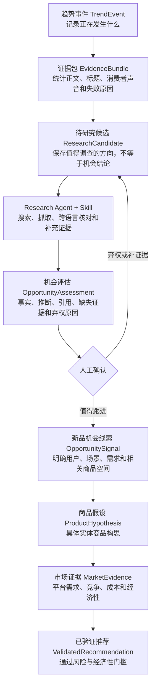

# 趋势机会研究架构：核心程序、EvidenceBundle 与 Research Agent

> **Historical / Archived**：本文是历史设计记录，不再是当前实现依据。当前业务流程以 [业务流程合同](../workflow-contract.md) 为准，当前技术结构以 [技术架构](../architecture.md) 为准。

> 实现状态（2026-07-18）：核心程序、EvidenceBundle、ResearchCandidate、ResearchRun、受控工具、Skill 和可选大模型 OpportunityAssessment 的结构与接口已落地，但尚未全部通过运行验收。默认 `ENABLE_EMBEDDINGS=false` 的 Candidate 入口已打通；二级正文已接入 Trafilatura 真实性校验、Google News RSS 主动搜索和独立来源去重。真实库仍缺少 ready Bundle 与人工研究样本。MCP 与浏览器登录态保持可选且默认不启用；当前状态以 `HANDOFF.md` 为准。

状态：核心主结构已实现，默认 Candidate 入口已验收，仍有后续运行缺口
日期：2026-07-18
适用范围：证据获取、待研究候选、机会评估、Skill/Agent 集成和事件详情解释

## 1. 架构决策

系统采用混合架构，不改造成纯 Agent，也不把开放式研究全部硬编码进定时程序。

- 核心程序是系统事实来源，负责采集、数据库、状态机、审计、确定性门槛和长期运行。
- Evidence 工具负责搜索、公开网页抓取、动态页面渲染、来源适配和人工证据接入。
- Research Skill 定义标准研究步骤、证据质量、弃权和写回规则。
- Research Agent 执行 Skill，编排工具并形成带引用的 OpportunityAssessment。
- Embedding 只负责检索、重复候选、跨语言匹配和类目联想。
- 大模型只基于已获取证据进行综合、判断和解释，不能补写无法访问的事实。

MCP 是工具接口的一种实现方式，不是大模型联网的必要条件。第一版工具可以是应用内部 Python 接口；需要跨进程或供外部 Agent 使用时再暴露为 MCP。

## 2. 目标链路



## 3. 当前实现与目标结构的关系

当前已经实现：

- TrendEvent、来源快照、事件成员和基础 Evidence。
- OpportunitySignal、人工反馈和快照。
- SemanticEventFeature、重复候选和离线评测。
- ProductHypothesis、MarketEvidence 和 ValidatedRecommendation。
- 确定性风险门、市场评分和推荐资格。

尚未实现：

- 结构化 EvidenceBundle。
- ResearchCandidate。
- OpportunityAssessment 独立对象。
- 来源专用证据适配器和搜索回退。
- Research Run、工具调用审计和 Agent API。
- 可复用 Research Skill。
- 事件页的结构化决策解释。

## 4. 分层职责

### 4.1 核心程序

必须由程序负责：

- 定时采集和原始响应审计。
- 事件聚类、趋势分和版本管理。
- 数据库、对象关系和状态转换。
- 证据 ID、URL、哈希、采集时间和来源。
- ResearchCandidate 队列、租约、超时和重试。
- Schema 校验、引用校验和风险门。
- 市场证据解析和确定性评分。
- 权限、幂等、通知和历史快照。
- 页面、API、人工审核和离线评测数据。

这些能力不能只存在于 Agent 对话上下文中。

### 4.2 证据工具层

工具只负责获取或整理证据，不负责得出商业结论。

建议工具：

- `search_public_news`：搜索公开新闻和官方来源。
- `fetch_public_page`：获取普通 HTML、meta、JSON-LD、AMP、移动版或打印版。
- `render_public_page`：渲染无需登录的 JavaScript 页面。
- `fetch_source_evidence`：调用来源专用适配器。
- `search_consumer_discussions`：搜索公开消费者讨论。
- `attach_manual_evidence`：接收人工 URL、正文、评论或文件摘录。
- `rebuild_evidence_bundle`：重新计算证据准备度。

工具可以先实现为应用内部 Protocol，之后按需要暴露为 MCP。

### 4.3 Research Skill

Skill 是研究流程和边界，不保存业务事实。

Skill 应规定：

1. 读取 TrendEvent、ResearchCandidate 和当前 EvidenceBundle。
2. 检查标题证据、抓取失败和缺失证据。
3. 构造事实搜索查询，不构造商品查询词。
4. 优先补充官方来源和独立完整正文。
5. 再搜索消费者讨论和现有商品痛点。
6. 去重、保存证据并重建 EvidenceBundle。
7. 证据不足时主动弃权。
8. 证据足够时生成带引用的 OpportunityAssessment。
9. 等待人工确认。
10. 只能通过受控 API 创建 OpportunitySignal。

### 4.4 Research Agent

Agent 是 Skill 的执行者，负责动态决定调用哪些工具、查询哪些关键词以及何时停止。

Agent 输入必须包含研究预算：

- 最大搜索次数。
- 最大抓取页面数。
- 最大浏览器页面数。
- 总超时。
- 允许的市场和语言。

Agent 输出必须是结构化对象，不接受只有自然语言报告的结果。

Agent 不能：

- 修改趋势分或事件事实。
- 直接创建 ProductHypothesis。
- 直接创建 ValidatedRecommendation。
- 绕过证据引用、人工审核和风险门。
- 把浏览器页面或对话上下文作为唯一事实来源。

### 4.5 模型层

Embedding：

- 事件和证据相关性。
- 跨语言匹配。
- 重复候选。
- 类目原型检索。

大模型：

- 跨来源证据综合。
- 区分事实和推断。
- 提取目标用户、新场景和未满足需求。
- 判断短时事件与持续变化。
- 生成可读解释和缺失证据清单。
- 主动弃权。

没有完整正文时，大模型不能用常识补写消费者需求。

## 5. 核心对象

### 5.1 EvidenceItem

每条证据必须区分内容强度：

```text
full_article
official_notice
article_summary
consumer_discussion
consumer_comment
search_snippet
title_only
manual_evidence
```

必须保存：

- 来源和 URL。
- 标题、摘要和正文摘录。
- 获取方式。
- 获取状态和失败原因。
- 是否消费者声音。
- 内容哈希。
- 证据质量分和质量版本。

### 5.2 EvidenceBundle

EvidenceBundle 是某一时点对事件证据准备度的不可变快照。

建议字段：

```text
event_id
input_hash
version
full_text_count
title_only_count
independent_source_count
consumer_voice_count
official_source_count
fetch_failure_reasons
evidence_ids
readiness_status
readiness_score
missing_evidence
created_at
```

`readiness_status`：

```text
insufficient
partial
ready_for_assessment
```

### 5.3 ResearchCandidate

ResearchCandidate 只表示值得调查，不表示已经发现新品机会。

建议字段：

```text
event_id
evidence_bundle_id
semantic_feature_id
candidate_reason
category_candidates
positive_similarity
negative_similarity
opportunity_delta
research_questions
missing_evidence
priority
status
engine
version
created_at
updated_at
```

状态：

```text
pending
researching
evidence_ready
insufficient_evidence
awaiting_review
completed
failed
superseded
```

### 5.4 OpportunityAssessment

OpportunityAssessment 是研究结果，不是 OpportunitySignal。

必须包含：

- `assessment_status`：`worth_following`、`abstained`、`insufficient_evidence`。
- 事实声明及引用证据 ID。
- 推断及支持证据 ID。
- 变化类型、持续性和交付周期判断。
- 目标用户、新场景和未满足需求。
- 相关实体商品类目。
- 缺失证据和弃权原因。
- Agent、Skill、模型和版本。

只有人工确认 `worth_following` 后才创建 OpportunitySignal。

## 6. 证据获取回退顺序

证据工具必须按以下顺序升级：

1. 数据源原始摘要、正文和关联 URL。
2. 普通公开 HTTP 抓取，允许安全重定向。
3. meta、JSON-LD、AMP、移动版和打印版。
4. 来源专用公开接口或适配器。
5. 同事件的独立公开新闻和官方来源。
6. 无需登录的浏览器动态渲染。
7. 用户明确授权的现有浏览器登录态。
8. 人工粘贴、URL、截图或文件摘录。
9. 仍不可用时记录 `evidence_unavailable` 并弃权。

禁止破解验证码、绕过付费墙或未授权访问控制。

## 7. 无大模型和有大模型两种运行模式

### 7.1 无大模型

```text
ResearchCandidate
  -> 规则生成事实查询
  -> 搜索 API / RSS / 来源适配器
  -> 正文抽取和去重
  -> BM25 / Embedding 相关性
  -> EvidenceBundle
  -> 人工 OpportunityAssessment
```

此模式应优先完成，确保系统在没有大模型时仍能可靠收集证据、解释停止原因并形成训练数据。

### 7.2 有大模型

```text
ResearchCandidate
  -> Agent 调用证据工具
  -> EvidenceBundle
  -> 大模型结构化 OpportunityAssessment
  -> Schema 和引用校验
  -> 人工确认
```

大模型不会获得直接写数据库权限，只能调用受控工具或 API。

## 8. 安全与审计

- 所有 URL 获取继续执行 SSRF 防护。
- 重定向后的每个目标都必须重新验证公网地址。
- 浏览器登录态不得保存密码、Cookie 或敏感页面正文到日志。
- 搜索查询、工具名称、请求哈希、状态、耗时和结果证据 ID 必须审计。
- 原始网页受版权和站点条款约束，默认保存必要摘录和哈希，不做公开内容镜像。
- Agent 失败或中断不得改变已有事实和审核状态。
- 同一 ResearchCandidate 使用租约和幂等键防止重复执行。

## 9. 页面信息架构

事件页按以下顺序展示：

1. 当前结论：趋势、待研究、证据不足、值得跟进或已弃权。
2. 停止原因：为什么没有形成 OpportunitySignal。
3. 探索性类目：逐项相似度，并明确不是概率或推荐。
4. 证据覆盖：正文、标题、独立来源、消费者声音和失败原因。
5. 下一步证据：需要补充什么。
6. Research Agent：启动状态、预算、工具记录和结果。
7. OpportunityAssessment。
8. 人工审核后的 OpportunitySignal。

## 10. 架构验收标准

- 无正文时先尝试公开回退，补不到则明确弃权。
- 标题证据不会被计作完整正文。
- 用户能一眼看懂为什么没有形成线索。
- ResearchCandidate 不会进入商品假设或推荐队列。
- 大模型每个事实和推断都有证据引用。
- Skill/Agent 中断后，数据库状态完整且可恢复。
- MCP 不成为核心程序的强制运行依赖。
- 最终推荐继续回溯完整证据链。
